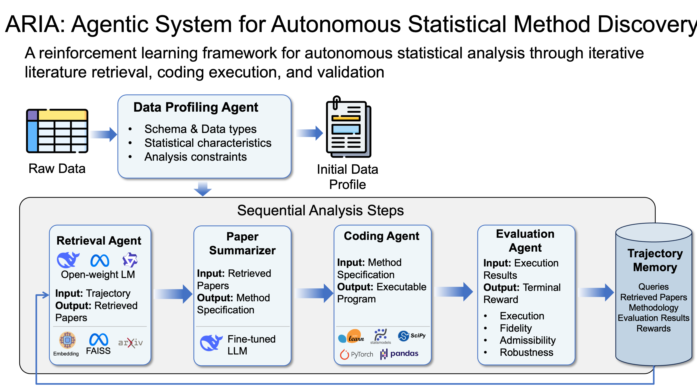

# ARIA

Ask a language model to analyze a dataset and it will confidently reach for the same three or four familiar methods, regardless of what the data actually looks like or what the specialist literature on the problem actually recommends. It will happily tell you it checked the assumptions. It usually didn't. And if the analysis is wrong, nothing in the loop is built to notice, because nothing is checking that the model's claims match what it actually ran.

That's the problem ARIA is built to answer. Not "can an LLM write pandas code" — it obviously can — but whether an autonomous agent can be trusted to do the more uncomfortable parts of science: go find out what's actually known about a problem, implement that faithfully instead of reaching for a shortcut, hold the result to a standard that can't be gamed by looking good on some other axis, and say "I don't know" out loud when it doesn't know.

Concretely, ARIA is a closed loop. Given a tabular dataset, it retrieves real methodology papers from arXiv relevant to the data in front of it — not a fixed shortlist, an actual search grounded in what the data looks like. It extracts a structured specification from whatever paper it lands on: the algorithm's steps, its assumptions, and the output it's obligated to produce. It writes bounded Python code implementing that specification, runs it in a sandboxed subprocess, and checks the result against a validation gate that is deliberately non-compensable — a fatal violated assumption can't be offset by a strong effect size somewhere else in the same rubric tree, the way an average would quietly let it. Only after clearing that gate does the agent decide whether to emit a finding or abstain.

That decision — emit or abstain — sits downstream of the one step that most determines everything else: the query the agent issues to go find methodology in the first place. A query policy is trained online with GRPO directly against this pipeline's own terminal reward, using the pipeline's real successes and failures as the signal, rather than a hand-labeled set of "good queries."

None of this is free, and the honest failure mode matters as much as the honest success. When this system abstains constantly, is that the model failing, or the evaluation criterion being too blunt to tell success from failure apart? Chasing down that distinction — and building a gate that can actually tell the difference — is most of what makes this an open research problem rather than a straightforward engineering exercise.

For how to actually run this end to end — the arXiv corpus, baseline rollouts, GRPO training on a rented GPU, the comparison table, the figures, the compiled paper — see `docs/RUNBOOK.md`.
